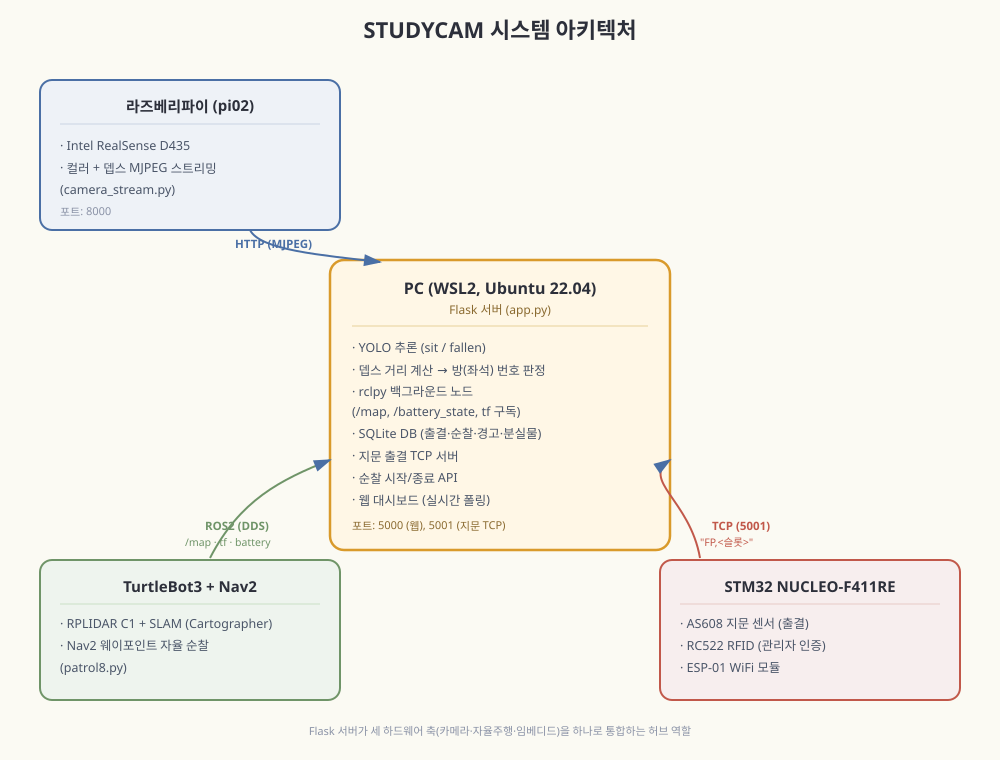

# Studyroom_monitoring_system

**스터디카페 무인 순찰 로봇 — TurtleBot3 기반 실시간 모니터링 & 출결 관리 시스템**

TurtleBot3가 스터디카페(1인실 7개)를 자율주행으로 순찰하면서, 카메라로 좌석 상황(쓰러짐/분실물)을 감지하고, 지문인식으로 출결을 자동 관리하는 통합 시스템입니다.

---

## 주요 기능

### 🗺️ 실시간 SLAM 지도
- ROS2 Nav2/Cartographer 기반 SLAM 맵을 웹 대시보드에 실시간 시각화
- 로봇 현재 위치·이동 궤적을 지도 위에 실시간 표시

### 📹 실시간 카메라 스트리밍 + 객체 인식
- Intel RealSense D435(컬러+뎁스) 스트림을 웹에서 실시간 확인
- YOLOv8 기반 4클래스 객체 인식(착석 sit / 쓰러짐 fallen / 분실물 item / 공석 empty)을 프레임에 오버레이
- 뎁스 카메라로 거리 계산 → 로봇 위치(tf)와 조합해 정확한 좌석(방) 번호 판정

### 🚨 위급상황 자동 감지
- 쓰러짐이 일정 시간(연속 감지) 이상 지속되면 자동으로 경고 발생
- 감지 즉시 DB 기록, 해당 좌석 UI 변경, 실시간 알림 팝업
- "조치 완료" 처리 시 자동으로 퇴실 처리(출결 기록 포함) + 출입문 자동 개방까지 한 번에 처리

### 🎒 분실물 감지
- 물건(item) 감지 + 좌석이 실제로 비어있음(empty 클래스 직접 감지) + DB 출결 기록상 공석, 세 조건이 모두 만족될 때만 분실물로 판정
- 좌석 공석 여부를 "착석(sit) 미감지"로 간접 추론하지 않고 empty 클래스를 직접 감지하도록 설계해 오탐 가능성을 줄임

### 🖐️ 지문인식 출결 관리
- STM32 + AS608 지문 센서로 학생별 입실/퇴실 자동 기록
- 같은 학생이 재인식하면 입실 ↔ 퇴실 자동 토글
- 좌석 현황 UI가 실제 출결 데이터를 그대로 반영

### 🚪 출입문 자동 제어
- 지문 인식 성공 / RFID 관리자 인증 성공 시 서보모터로 출입문 자동 개폐
- 웹 대시보드에서 위급상황 "조치 완료" 처리 시, 서버가 STM32에 원격으로 개방 신호를 전송해 출입문도 함께 열리도록 연동
  (지문 출결 전송용 TCP 채널을 양방향으로 확장해 구현)

### 🚶 자율주행 순찰
- 정식 ROS2 노드(`patrol_pkg`)로 구현 — `NavigateToPose` 액션 클라이언트를 직접 사용한 콜백 기반(논블로킹) 구조
- 지도상 9개 웨이포인트를 정방향 순회 후 역순으로 귀환하는 왕복 순찰
- 웨이포인트별 정지 시간 확보 및 도착 시 바라보는 방향(yaw) 지정
  → 칸막이 좌석 구조에 맞춰 좌/우 회전하여 객체 인식 사각지대 최소화
- 오도메트리 누적 오차(위치 드리프트) 자동 보정
  → 매 바퀴 시작점 복귀 시 `/initialpose` 재발행으로 AMCL 위치 추정 재조정
- 순찰 한 바퀴 완료 시마다 횟수 자동 기록, 시작/종료 실시간 이벤트 알림

---

## 시스템 아키텍처



### 핵심 설계 원칙

- **하드웨어 I/O는 파이/STM32, 지능적 처리(YOLO, DB, 로직)는 PC** — 역할을 명확히 분리
- **DDS(ROS2) vs HTTP vs TCP** — 각 통신 방식의 특성에 맞게 선택
  - SLAM/배터리: ROS2 DDS 자동 발견 (IP 하드코딩 불필요)
  - 카메라 스트리밍: HTTP MJPEG (직접 파싱)
  - 지문 출결: 순수 TCP 소켓 (ESP01 AT 커맨드 특성상 HTTP 불가) — 출결 데이터 수신뿐 아니라 출입문 원격 개방 명령 전송까지 양방향으로 활용
  - 순찰 이벤트: 일반 HTTP POST
- **순찰 로직은 스크립트가 아닌 정식 ROS2 노드로 구현** — `ros2 node list`에 등록되어 다른 시스템 노드와 동일하게 관리/확인 가능하며, launch 파일 통합 및 향후 기능 확장(YOLO 인식 결과 실시간 반영 등)에 유리한 구조 채택

---

## Trouble Shooting

| 문제 | 원인 | 해결 |
|---|---|---|
| `/odom` 토픽 수 초씩 끊김, Nav2 목표 이동 실패(`aborted`) | VM에 호스트 물리 코어를 과할당, 3D 가속 부하 | VM 코어 축소(8→6), 3D 가속 비활성화로 안정화 |
| 순찰 중 위치 추정 오차 누적 | 오도메트리(바퀴 슬립) 누적 드리프트 | 매 바퀴 시작점 복귀 시 AMCL 위치 재보정(`/initialpose` 재발행) |
| 컬러+뎁스 동시 스트리밍 시 프레임 드롭/처리 실패 | USB 대역폭 부족 | USB 3.0 포트 사용, 컬러/뎁스 공통 지원 해상도(640×480)로 통일, 프레임레이트 조정 |
| RealSense 다중 접속 시 스트림 실패 | 카메라는 한 프로세스만 독점 가능한데 접속자마다 pipeline 재오픈 | 캡처 전용 스레드 1개 + 공유 프레임 버퍼 구조로 재설계, 다중 클라이언트는 버퍼만 읽도록 변경 |
| 웨이포인트 순찰 로직을 스크립트로만 구현 시 확장성 저하 | `time.sleep` 기반 블로킹 구조, 다른 노드와 통합 어려움 | `NavigateToPose` 액션 클라이언트 + 타이머 콜백 기반 정식 ROS2 노드(`patrol_pkg`)로 재구현 |

---

## 기술 스택

| 분류 | 기술 |
|---|---|
| 로봇 | TurtleBot3 Burger, RPLIDAR C1, Intel RealSense D435 |
| 자율주행 | ROS2 Humble, Nav2, Cartographer, 정식 ROS2 패키지(`colcon`, `ros2 run`) |
| 임베디드 | STM32 NUCLEO-F411RE (HAL), AS608, MFRC522, ESP-01, 서보모터 |
| AI | YOLOv8 (Ultralytics, 4클래스: sit/fallen/item/empty), pyrealsense2 |
| 백엔드 | Python, Flask, SQLite, rclpy |
| 프론트엔드 | HTML/CSS/JavaScript (Vanilla) |
| 개발 환경 | WSL2 (Ubuntu 22.04) + Windows, VirtualBox (Ubuntu, Nav2/RViz) |

---

## 실행 방법

### 1. 사전 준비
- WSL2(Ubuntu 22.04) + ROS2 Humble 설치
- `.wslconfig`에 미러 네트워킹 모드 설정
- Windows 방화벽에 필요한 포트 인바운드 규칙 추가 (ROS2 DDS UDP, Flask 5000, 지문 TCP 5001)

### 2. 저장소 클론 및 환경 설정
```bash
git clone https://github.com/koesunghoon/Studyroom_monitoring_system.git
cd Studyroom_monitoring_system/studycam_server

python3 -m venv --system-site-packages venv
source venv/bin/activate
pip install -r requirements.txt
```

### 3. 터틀봇 쪽 실행

```bash
# [라즈베리파이] 브링업
ros2 launch turtlebot3_bringup robot.launch.py

# [라즈베리파이] 카메라 스트리밍 (컬러+뎁스)
python3 camera_stream.py
```

```bash
# [PC] Nav2 + 저장된 지도 로드
ros2 launch turtlebot3_navigation2 navigation2.launch.py map:=$HOME/map2.yaml
# RViz에서 2D Pose Estimate로 초기 위치 지정

# [PC] patrol_pkg 최초 빌드 (1회만)
cd ~/turtlebot3_ws/src
# patrol_pkg 소스 배치 후
cd ~/turtlebot3_ws
colcon build --packages-select patrol_pkg
source install/setup.bash

# [PC] 순찰 노드 실행
ros2 run patrol_pkg patrol_node
```

**확인:**
```bash
ros2 node list        # /patrol_node 등록 확인
ros2 node info /patrol_node   # /navigate_to_pose 액션 클라이언트 확인
```

### 4. 웹 서버 실행
```bash
cd studycam_server
source venv/bin/activate
python app.py
```
브라우저에서 `http://localhost:5000` 접속

---

## 팀 구성

| 담당 | 역할 |
|---|---|
| _(고성훈)_ | 프로젝트 총괄, STM32 임베디드 (지문인식 AS608, RFID 관리자 인증, WiFi 통신, 출입문 서보모터 제어) |
| _(고경민, 김재민)_ | TurtleBot3 SLAM/Nav2, 자율주행 순찰 로직(ROS2 노드화), RealSense 카메라 스트리밍 |
| _(김준혁)_ | 웹 대시보드, Flask 서버, YOLO 연동, DB 설계 |
| _(고지훈, 김준혁)_ | YOLO 연동 |
---
